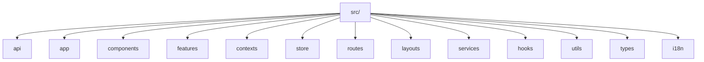
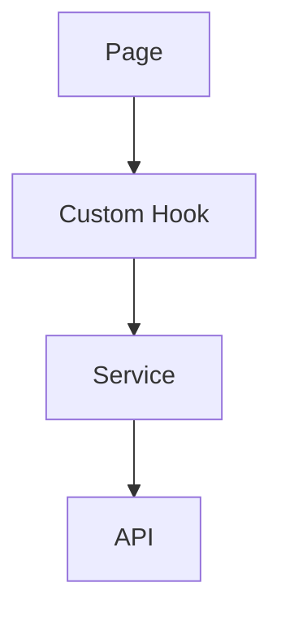
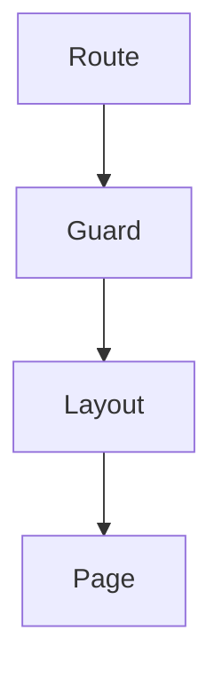
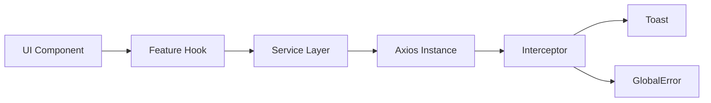

```md
# 🚀 React Application Architecture Guide

This project follows a **feature-based, scalable, enterprise-ready structure**.

It is designed for:

- ✅ Clean separation of concerns  
- ✅ Easy onboarding for new developers  
- ✅ Scalable architecture  
- ✅ Centralized error handling  
- ✅ Modular features  
- ✅ Reusable UI components  

---

# 📦 Tech Stack

- React + TypeScript
- Redux Toolkit
- React Router
- Axios
- Tailwind / CSS Modules
- React Hot Toast
- Context API (Theme, Language, Global Error)

---

# 🏗️ Project Structure Overview



---

# 📁 What Each Folder Does

| Folder          | Purpose                                 |
| --------------- | --------------------------------------- |
| **api/**        | Axios setup & interceptors              |
| **app/**        | App entry & global providers            |
| **components/** | Shared reusable UI                      |
| **features/**   | Feature-based modules (auth, etc.)      |
| **contexts/**   | Global Context (Theme, Language, Error) |
| **store/**      | Redux configuration                     |
| **routes/**     | Route definitions & guards              |
| **layouts/**    | Layout wrappers                         |
| **services/**   | Business logic layer                    |
| **hooks/**      | Reusable custom hooks                   |
| **utils/**      | Helper functions                        |
| **types/**      | Global TypeScript types                 |
| **i18n/**       | Localization setup                      |

---

# 🧠 How to Think About It

```
UI (components / pages)
        ↓
Feature Logic (features)
        ↓
Services (services / api)
        ↓
Global Systems (contexts / store)
```
---

# 🔥 Application Boot Flow

```mermaid
flowchart TD
    A[main.tsx] --> B[App.tsx]
    B --> C[AppProviders]
    C --> D[Router]
    D --> E[Layout]
    E --> F[Feature Pages]
````

---

# 🧩 AppProviders Explained

`AppProviders.tsx` wraps the entire application with:

* ThemeProvider
* LanguageProvider
* GlobalErrorProvider
* ToastProvider
* ErrorBoundary

This ensures:

* 🌗 Global theme control
* 🌍 Localization
* 🚨 Centralized error UI
* 🔔 Global toast system
* 🛡 Runtime crash protection

---

# 🌐 API Request Flow

```mermaid
flowchart TD
    A[Component] --> B[Feature Hook]
    B --> C[Service Layer]
    C --> D[axiosInstance]
    D --> E[Interceptor]
    E --> F[ErrorHandler]
    F --> G[Toast / GlobalErrorView]
```

### Interceptor Responsibilities

* Attach access token
* Refresh expired tokens
* Handle HTTP errors
* Trigger global error UI if needed

---

# 🛑 Error Handling Strategy

We use **two levels of error handling**:

---

## 1️⃣ Runtime Errors

Handled by:

```
ErrorBoundary
```

Catches:

* JavaScript crashes
* Rendering failures

---

## 2️⃣ HTTP Errors

Handled by:

```
Axios Interceptor
```

Triggers:

* Toast notifications
* Global error screen (for critical errors)

---

# 🔔 Toast System

Location:

```
components/feedback/toast/
```

Supports:

* Custom toast UI
* Promise-based toast
* Lottie / Image / Icon support
* Pause on hover
* Custom action button
* Centralized styling

### Basic Usage

```ts
showToast({
  type: "success",
  text1: "Profile updated successfully"
});
```

### Promise Usage

```ts
showPromiseToast(apiCall(), {
  loading: "Loading...",
  success: "Completed!",
  error: "Something went wrong"
});
```

---

# 🎨 Theme System

Theme is handled using:

```
contexts/ThemeContext.tsx
```

* Light / Dark toggle
* Applied via root class
* Tailwind handles actual styling

Example:

```tsx
<div className="bg-white dark:bg-black">
```

---

# 🔐 Feature-Based Architecture Example (Auth)

```
features/auth/
 ├── hooks/
 ├── pages/
 ├── schemas/
 ├── services/
 ├── authSlice.ts
 └── types.ts
```

### Feature Flow



This keeps:

* UI separate from logic
* Business logic reusable
* API layer clean

---

# 🧠 Redux Store

Located in:

```
store/
```

Contains:

* rootReducer
* middleware
* feature slices

Each feature can maintain its own slice.

---

# 🌍 Internationalization

Location:

```
i18n/
```

Includes:

* locales/
* config
* useTranslation hook

---

# 🛡 Route Guards

Location:

```
routes/
```

Includes:

* AuthGuard
* GuestGuard
* AdminGuard

Flow:



---

# 🏗 Layout System

Location:

```
layouts/
```

Examples:

* AdminLayout
* AuthLayout
* MainLayout

Layouts wrap route groups.

---

# 🧰 Utilities

Location:

```
utils/
```

Examples:

* dateFormatter
* ErrorHandler
* validators

Reusable helper logic only.

---

# 🆕 How To Add New Feature

Example: Add "Profile" Feature

1. Create folder:

```
features/profile/
```

2. Add:

```
pages/
hooks/
services/
profileSlice.ts
types.ts
```

3. Register route inside:

```
routes/routePaths.ts
```

4. Use layout if required.

---

# 🧑‍💻 Developer Onboarding

## 1️⃣ Install Dependencies

```bash
npm install
```

## 2️⃣ Setup Environment

Copy:

```
.env.sample → .env
```

## 3️⃣ Start Development

```bash
npm run dev
```

---

# 📌 Development Rules

* ❌ No direct API calls inside components
* ✅ Use services layer
* ✅ Use hooks for business logic
* ✅ Keep components reusable
* ✅ All HTTP errors handled centrally
* ❌ No duplicate theme systems

---

# 🏆 Architecture Principles Followed

* Feature-Based Architecture
* Separation of Concerns
* Single Responsibility Principle
* Centralized Error Handling
* Modular Design
* Scalable Folder Structure

---

# 📊 System Overview Diagram



---

# 🚀 Future Enhancements

* Unit Testing Setup
* E2E Testing
* CI/CD Integration
* Performance Monitoring
* Logging Enhancements

---

# 👥 Contribution Guidelines

* Follow feature-based structure
* Use TypeScript strictly
* Keep logic inside hooks/services
* Maintain clean separation
* Follow lint rules

---

# 🏁 Final Notes

This architecture is designed for:

* Scalability
* Maintainability
* Team collaboration
* Enterprise-level applications

If unsure where to place code:

* UI → `components/`
* Feature logic → `features/`
* API logic → `services/`
* Global state → `store/`
* Helpers → `utils/`

---

# 🎨 Styling Setup (Tailwind / Bootstrap)

This project supports utility-based styling using either **Tailwind CSS** or **Bootstrap**.

---

## ✅ Option 1: Add Tailwind CSS (Recommended)

### 1️⃣ Install (Yarn)

```bash
yarn add -D tailwindcss @tailwindcss/postcss postcss autoprefixer
````

### 2️⃣ Create Configuration Files

Create `tailwind.config.js`:

```js
export default {
  content: ["./index.html", "./src/**/*.{js,ts,jsx,tsx}"],
  darkMode: "class",
  theme: { extend: {} },
  plugins: [],
};
```

Create `postcss.config.js`:

```js
export default {
  plugins: {
    "@tailwindcss/postcss": {},
    autoprefixer: {},
  },
};
```

### 3️⃣ Add Tailwind to CSS

In `src/index.css`:

```css
@import "tailwindcss";
```

### 4️⃣ Use in Components

```tsx
<div className="bg-blue-500 text-white p-4 rounded">
  Tailwind is working 🎉
</div>
```

---

## ✅ Option 2: Add Bootstrap

### 1️⃣ Install

```bash
yarn add bootstrap
```

### 2️⃣ Import in `main.tsx` or `index.tsx`

```tsx
import "bootstrap/dist/css/bootstrap.min.css";
```

### 3️⃣ Use in Components

```tsx
<button className="btn btn-primary">
  Bootstrap Button
</button>
```

---

## 🧠 Recommendation

* Use **Tailwind** for utility-first scalable styling.
* Use **Bootstrap** if you need ready-made UI components.
* Avoid mixing multiple styling systems unless necessary.

---

Happy Coding 🚀

